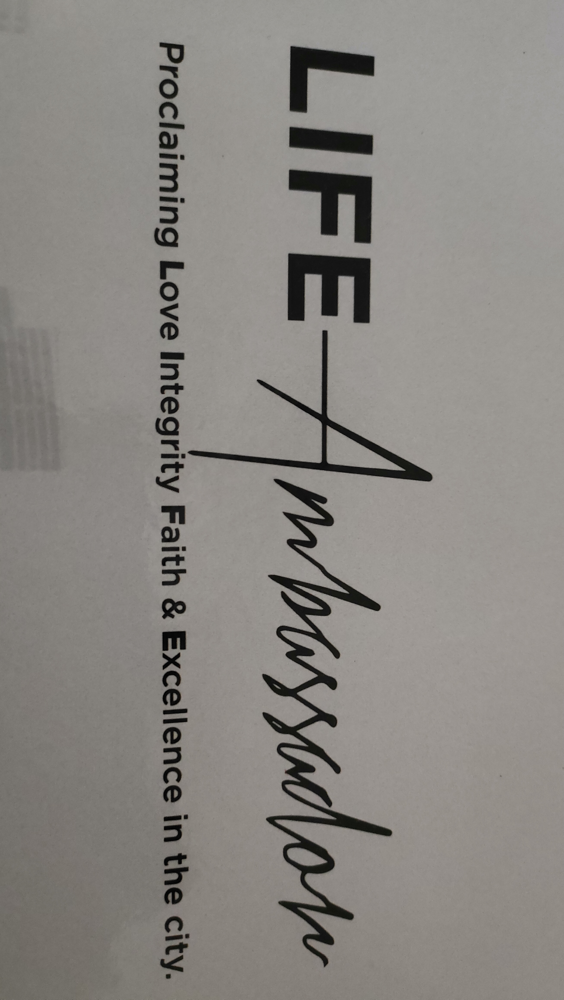

- [[Training/Life Institute/Life Ambassador]]
  collapsed:: true
	- 
	- It is a twelve-day leadership program that envisions to develop a generation of young leaders of Church of God World Mission Philippines to move forward in leading, helping, and planting new churches toward greater growth in the cities.
		- **Mission**
			- to provide a combination of practical trainings, bible courses, leadership seminars and personal reflection activities in the areas of #LIFE Life, Integrity, Faith, Excellence
				- ***LIFE*** comes from the two Hebrew words **Bios** *(existence)* and **Zoe** *(passionate life)*
					- ***LIFE*** is living out a passionate life
	- The ambassador word is written in a heartbeat design because  being an ambassador carries the heartbeat of God
	- Life ambassador program applies the **"Backpack"** #Principle #backpackprinciple
		- A mountaineer would only bring the necessary things in his/her backpack in order to climb and overcome the mountain.
		- Likewise, a Life Ambassador student will be equipped with only what is necessary in planting a new church in the city.
	- Characters of a Life Ambassador - #Dependable
		- Can be trusted
		  Can finish strong
		  Future of COG
		  
		  #Reliable
		  Can give support
		  Can make things happen
		  Next in line in COG
- [[Notes/Preaching]]
  collapsed:: true
	- ### Locked-In by Ptr. Aj Velasco
	- #### Biblical Foundation
		- Nehemiah 3:1-6
	- #### Biblical Context
		- The Rebuilding of Jerusalem to its former glory
		- Nehemiah
			- -Best example of someone who is Locked-in
			- -Nehemiah had the **RIGHT** *burden, purpose, choice, course of action*
		- But he can't do it all by himself, for him to achieve great things, Nehemiah needs people that would help him
	- #### Opening #Prayer
		- Hallelujah Lord Jesus Christ we invite your presence to be here, and Lord God we allow you to move, we allow you to interfere for this service is about You. We are open for Your Word, we are open Lord God for your movement, we are open Lord God for You to speak in our hearts and minds right this very moment. We humbly ask for Your anointing, Your favor and right this very moment we already claim the victory and we bring you back all the glory and the praise in the name of Jesus Christ. Amen
	- #### Introduction
		- Importance of Rebuilding the walls of Jerusalem
			- *Security*
			  logseq.order-list-type:: number
			- *Stability* (establishing their Identity)
			  logseq.order-list-type:: number
			- *Significance*
			  logseq.order-list-type:: number
		- Lee Kwan You
			- "We must be ***identifiable*** and ***recognizable***"
		- As Christians:
			- -we should be **identifiable** and **recognizable*** as Christ's Ambassadors
	- #### Exposition
		- **Eliashib** ( means God Restores)
			- comes from two Hebrew words
				- El (God)
				  logseq.order-list-type:: number
				- Shou (we must turn back to God)
				  logseq.order-list-type:: number
		- #### #Theme Initiate
			- involve yourself in the ministry, take the step
			- Casting of the Net #castingofthenet
				- **John 21:6**
				- Where do we cast our net?
					- Left Side of the boat (World)
						- -wealth
						- -opportunities
						- -resources
						- -luxury
						- -we can be debt-free
					- Right Side of the boat (God)
						- -involve in WORDA
						- -obey God's Word
		- Tekoite nobles  *Nehemiah 3:5*
			- -the group of nobles who didn't help in rebuilding the wall of Jerusalem during Nehemiah's time
		- #### 1. Locked-In the Mission
			- -they knew how to achieve the mission buy doing and not sitting around
		- #### 2. Locked-In their Purpose
		- #### 3. Locked-In their Passion
			-