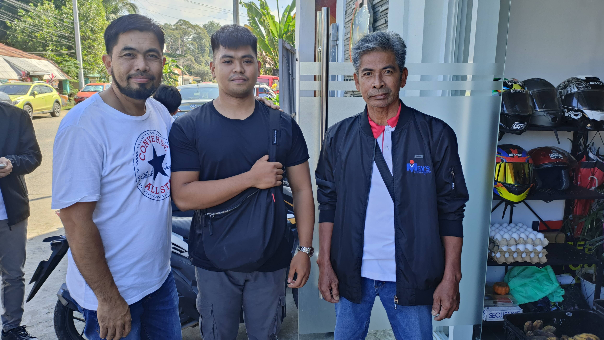

### Daily Metrics
	- DONE [[Devotion/Personal]]
	  collapsed:: true
	  :LOGBOOK:
	  CLOCK: [2024-01-05 Fri 10:06:28]--[2024-01-05 Fri 10:06:29] =>  00:00:01
	  :END:
		- Scripture: 1 Thessalonians 3
		- tags:: encouragement,
		- Notes
			- Command: Love one another. Grow in love. Here, apostle Paul reminds the 1st century church in Thessalonica through prayer, to grow in love for one another. He prays that the church increases love and that the Lord not only increases, but also make it to an overflow of love for each other and everyone else. And not only to love one another, but also to love everyone else. The church is for everyone not just for its members. Love should be shown not only to the believers, but also to non-believers. Apostle Paul not just prays and commands the church to to this, but also they practice it. Just as he wrote in verse 12 "just as ours does for you". Paul and his team practice what they preach, and the impact to every missionary journey is so powerful because of this. Not to remove the power of the Gospel and the Holy Spirit, but practiced command or encouragement is much more effective than just a command.
			- Promise:
			- Sin to Avoid:
	- TODO Physical Workout
- ### Engineer's Daybook
	- #### Notes:
		- #+BEGIN_QUOTE
		  Obeying is better than sacrifice
		  --- **Samuel @ 1 Samuel 14** #quote
		  #+END_QUOTE
		- iLead Tshirt Sizes
			- Dionisio Andres Jr.
			  |**tshirt**|**jacket**|
			  |L|M|
			- Michael Angelo Gepilano
			  |**tshirt**|**jacket**|
			  |XL|XL|
			- Ryan Agustin
			  |**tshirt**|**jacket**|
			  |XL|XL|
			- Mark Lester Roque
			  |**tshirt**|**jacket**|
			  |XL|XL|
			- Elbert Licayan
			  |**tshirt**|**jacket**|
			  |M|S|
			- Larry Salvador
			  |**tshirt**|**jacket**|
			  |n/a|n/a|
			- Hervison Sareno
			  |**tshirt**|**jacket**|
			  |L|M|
			- Mark Ryan Pablo
			  |**tshirt**|**jacket**|
			  |M|L|
			- John Paul Taguba
			  |**tshirt**|**jacket**|
			  |XL|XL|
			- Gener Pagalilauan
			  |**tshirt**|**jacket**|
			  |L|M|
			-
			-
	- #### Tasks:
		-
- ### Time-blocker
	- #### Morning:
	  collapsed:: true
		- 6:00
			-
		- 6:30
			-
		- 7:00
			-
		- 7:30
			-
		- 8:00
			-
		- 8:30
			- :LOGBOOK:
			  CLOCK: [2023-11-17 Fri 11:18:44]
			  :END:
		- 9:00
			-
		- 9:30
			-
		- 10:00
			-
		- 10:30
			-
		- 11:00
			-
		- 11:30
	- #### Lunch:
	  collapsed:: true
		- 12:00
			-
		- 12:30
			-
	- #### Afternoon:
	  collapsed:: true
		- 1:00
			-
		- 1:30
			-
		- 2:00
			-
		- 2:30
			-
		- 3:00
			-
		- 3:30
			-
		- 4:00
			-
		- 4:30
			-
		- 5:00
			-
		- 5:30
			-
	- #### Evening:
	  collapsed:: true
		- 6:00
			-
		- 6:30
			-
		- 7:00
			-
		- 7:30
			-
		- 8:00
			-
		- 8:30
			-
		- 9:00
			-
		- 9:30
			-
		- 10:00
			-
		- 10:30
			-
		- 11:00
			-
		- 11:30
			-
- [[Relationship Department/Connection]]
	- 2024-01-21
		-  
		  Middle (JC Reyes) - maternal 1st cousin of pastor David Ingiaen
		-  
		  Left (Jaime Mangantulao), Right (Edward de Guzman)
-